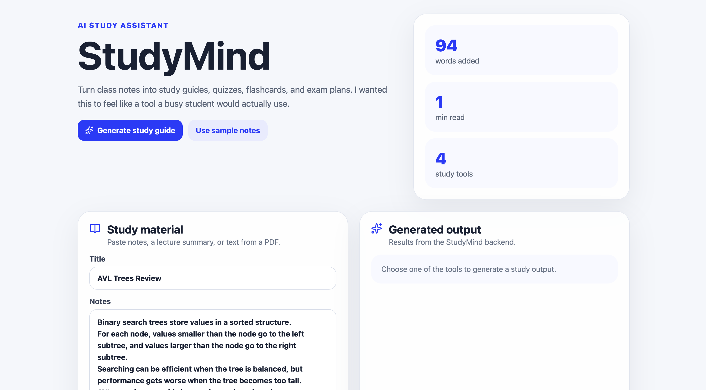
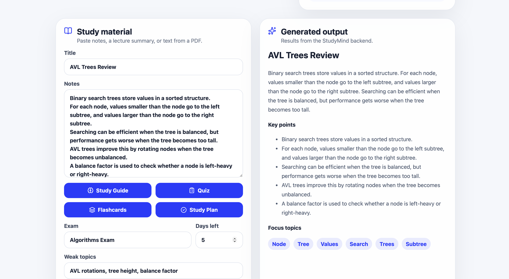
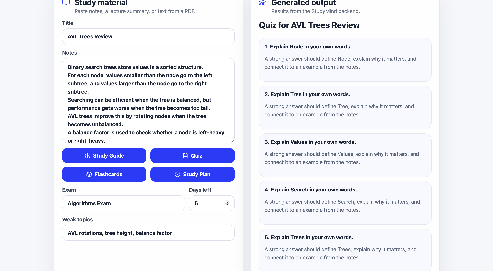

# StudyMind

StudyMind is an AI-powered study assistant for college students. It helps turn lecture notes, PDFs, and class material into study guides, quizzes, flashcards, and personalized exam preparation plans.

I built this project because I have been both a college student and a programming tutor. I know how overwhelming it can be to study from scattered lecture slides, notes, PDFs, and assignments. My goal was to build a tool that feels genuinely useful for students rather than just another generic AI chatbot.

---

## Screenshots

### Dashboard



### Study Guide Generation



### Quiz Generation



---

## Features

- Upload or paste study material
- Generate structured study guides
- Create quiz questions from notes
- Generate flashcards for review
- Build personalized study plans
- Identify important concepts and focus topics
- Clean and responsive user interface
- FastAPI backend with REST API endpoints
- React frontend built with reusable components

---

## Why I Built This Project

Many students already use AI while studying, but most existing tools are too general. I wanted to create an application focused specifically on learning.

StudyMind organizes study material into useful learning resources such as summaries, quizzes, flashcards, and study plans. The project also allowed me to gain experience designing a full-stack application with a React frontend and FastAPI backend while building an architecture that can later support modern AI technologies such as LLMs and Retrieval-Augmented Generation (RAG).

---

## Tech Stack

### Frontend

- React
- Vite
- JavaScript
- CSS

### Backend

- Python
- FastAPI
- Pydantic
- Uvicorn

---

## Current Features

The current version includes a complete demonstration workflow.

- Study material input
- Study guide generation
- Quiz generation
- Flashcard generation
- Study plan generation
- Backend REST API
- Responsive interface
- Organized project structure

The backend currently uses rule-based content generation so the application can run without requiring an external AI API or API key. The project architecture is designed to support future integration with OpenAI or other LLM providers.

---

## Planned AI Features

Future versions of StudyMind will include:

- LLM-generated study guides
- AI-powered quiz generation
- AI-generated flashcards
- PDF upload and parsing
- Document question answering
- Embeddings and vector search
- Retrieval-Augmented Generation (RAG)

---

## Architecture

StudyMind uses a modern full-stack architecture.

```
React Frontend
        │
        ▼
 FastAPI Backend
        │
        ▼
 Rule-Based Content Generation
        │
        ▼
Future LLM + RAG Integration
```

---

## Project Structure

```text
StudyMind/
├── frontend/
│   ├── src/
│   ├── public/
│   ├── package.json
│   └── vite.config.js
│
├── backend/
│   ├── app/
│   ├── requirements.txt
│   └── README.md
│
├── database/
│   └── schema.sql
│
├── docs/
│   └── screenshots/
│
└── README.md
```

---

## Running the Project

### Frontend

```bash
cd frontend
npm install
npm run dev
```

Open the local Vite URL shown in the terminal.

### Backend

```bash
cd backend

python -m venv venv

source venv/bin/activate

pip install -r requirements.txt

uvicorn app.main:app --reload
```

The backend runs at:

```
http://127.0.0.1:8000
```

---

## API Endpoints

```
GET  /health

POST /api/study-guide
POST /api/quiz
POST /api/flashcards
POST /api/study-plan
```

---

## Future Improvements

- User authentication
- Study history
- PostgreSQL database
- PDF text extraction
- Cloud deployment
- User dashboards
- Progress tracking
- Study streaks
- AI personalization
- Mobile-friendly improvements

---

## What I Learned

This project helped me strengthen my understanding of full-stack software development by connecting a React frontend with a FastAPI backend and designing REST APIs for communication between both layers.

I also learned how to organize a larger project into maintainable components while separating the user interface from the study-generation logic. Building the application with a modular architecture makes it easier to extend with modern AI capabilities such as document processing, LLM integration, and Retrieval-Augmented Generation in future versions.

---

## Author

**Merra Migora**

Computer Science Student  
University of Washington Tacoma
